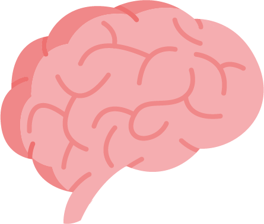
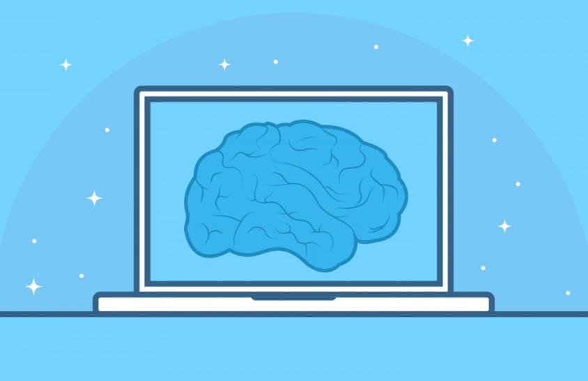

# About Me 

I am extremely passionate about my education in cognitive science and neuroscience and aim to use what I have learned to have a deeper understanding of the mind and our cognitive capacities. With that I would like to optimize human functionality and enrich education research/teaching. I aim to pursue a career in which I can apply my love for tech and programming with optimizing our cognition and compliment, as well as enhance our cognitive capacities.
  

  
### Some of my interests: 
* Watching hockey, cricket and football (soccer)
* Cooking
* Reading romance, mysteries and psychothrillers
* Swimming, biking and travelling
* Helping others (community involvement; volunteering) and Teaching

 
### Education
Currently in Medical Radiation Sciences at Uoft-Michener 
Hold an HBSc. Neuroscience and Cognitive Science (Computational Cognition) Nov 2018 
University of Toronto 
St. George Campus 
